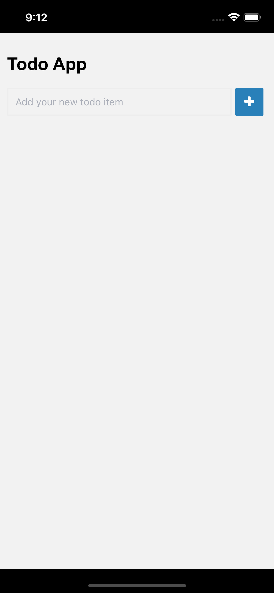
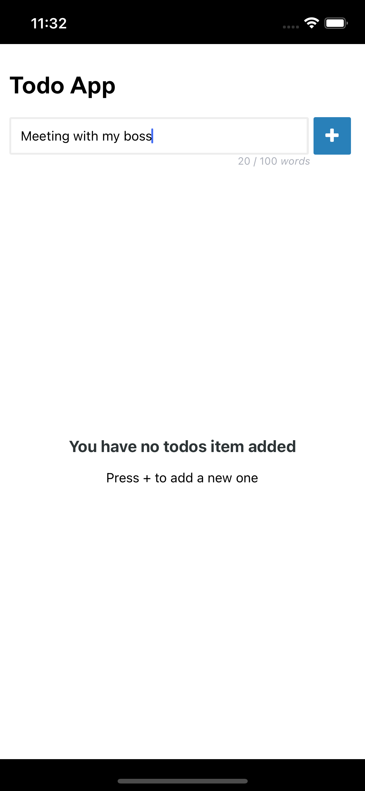
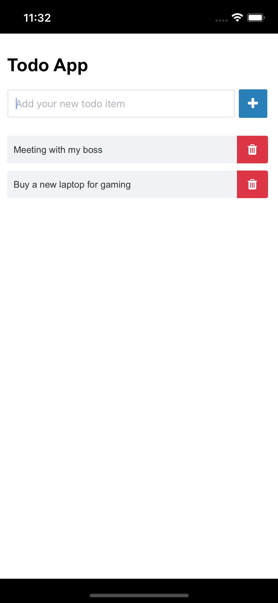

# React Native Todo List

This is a react native new app using React Native + TypeScript + Redux

## Technology

- React Native
- React Navigation
- React Native Vector Icons
- TypeScript
- Redux

## Requirements

- [Node.js v10+](https://nodejs.org/)
- [React Native CLI](https://www.npmjs.com/package/react-native-cli)
- Xcode Command Line tools (`xcode-select --install`)
- [CocoaPods](https://cocoapods.org/) (`gem install cocoapods`)

## Preview

Main Screen                |  Character Counter
:-------------------------:|:-------------------------:
  |  

Todo List View             | 
:-------------------------:|
 | 

